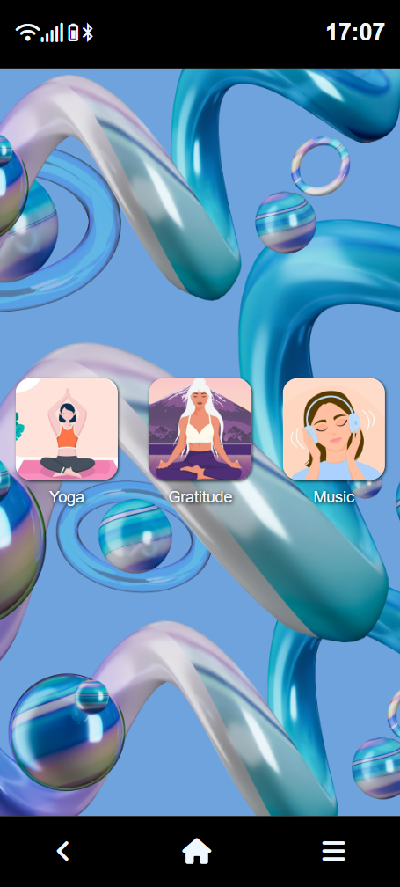
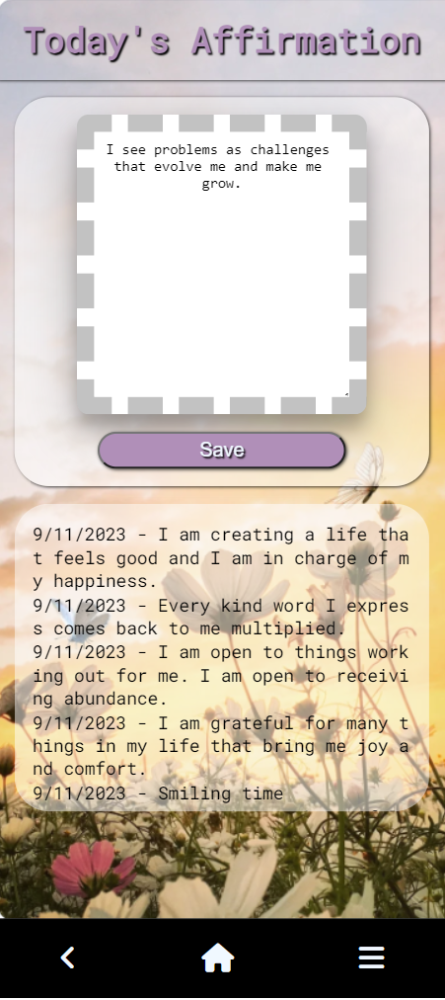
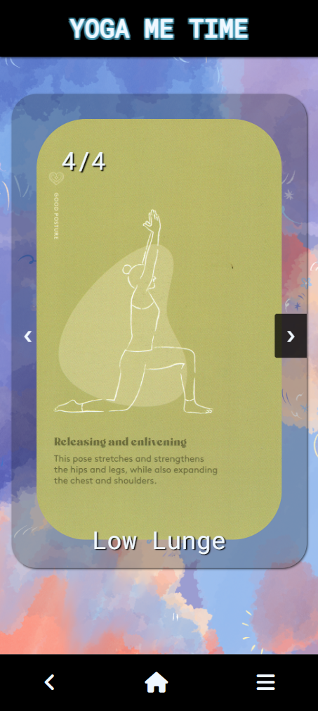
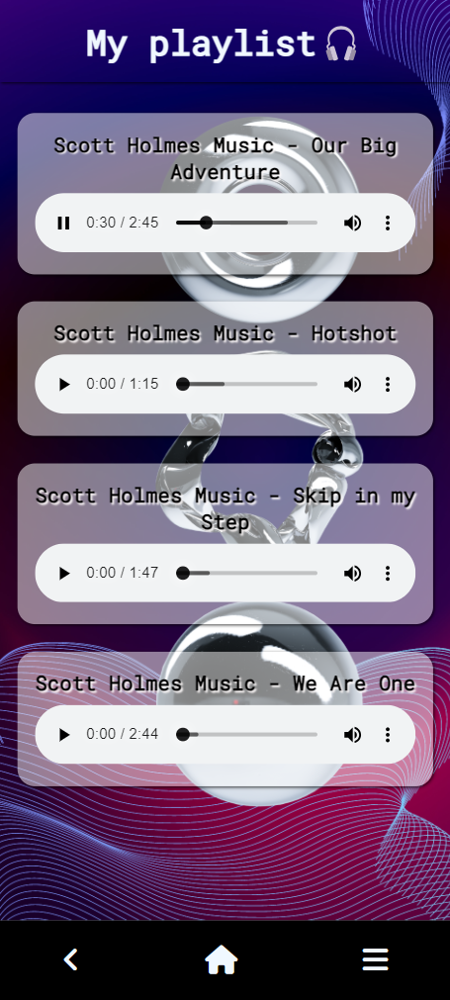

# **FakeOS**

## **Table of Contents** 

  - [**Table of Contents**](#table-of-contents)
  - [**Description**](#description)
  - [**Technologies Used**](#technologies-used)
  - [**Preview**](#preview)
  - [**Deployed link**](#deployed-link)
  - [**Future Development**](#future-development)
  - [**Questions**](#questions)

## **Description**
 
This project recreated a Android phone, where the user has three applications to interact with. The responsivness is working in current mobile screens and tablets. 

This project was very useful to practice array iterators, objects, callback functions and manipulation of the DOM.

The visual appeareance was a good opportunity to continuing expanding my knowlodge of SCSS and the BEM convention.
Using modals to display the applications and interact with them was a new topic to explore and put into practice.

## **Technologies Used**

* HTML
* Sass/Scss
* CSS
* JavaScript

## **Preview**
 

## **Deployed link**

💡 Live version: [click here!(to be deployed)]()

## **Future Development**

* Display the current weather.
* Gratitude App : include clear messages functionality and more sections to write. 
* Yoga App: include more yoga posses and timer for each one.
* Music App: include more songs and a playlist creator.

## **Questions**

* Contact me on my GitHub profile: [Marcela's GitHub](https://github.com/marcelamejiao)
